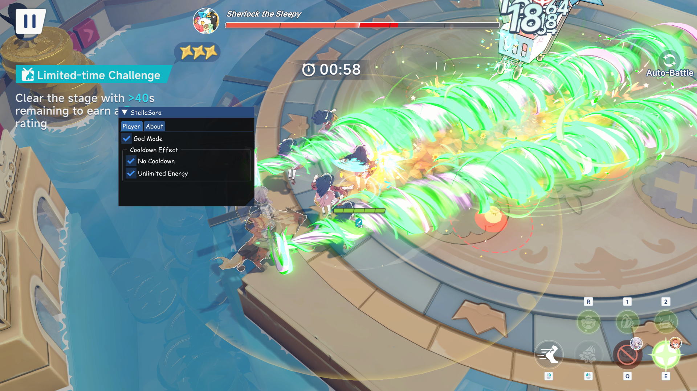

## Stella Sora Tool & Launcher

A comprehensive cheat tool with integrated launcher for Honkai: Star Rail, featuring anti-cheat bypass and automatic DLL injection.

## 🚀 Quick Start

### Method 1: Using the Launcher (Recommended)
1. Build the solution using `build_launcher.bat`
2. Run `StellaSora-Launcher.exe` as Administrator
3. The launcher will automatically:
   - Find your game installation
   - Launch the game with ACE bypass
   - Inject the cheat DLL
   - Open the cheat menu (Press F1)

### Method 2: Manual Injection
1. Build the `StellaSora-Tool.dll`
2. Use your preferred injector to inject the DLL
3. Press F1 to show the menu



## 📋 Features

### Cheat Features
- **God Mode**: Invincibility and damage immunity
- **No Cooldown**: Remove skill and ultimate cooldowns
- **Unlimited Energy**: Infinite energy for abilities
- **Hit Effects**: Enhanced visual effects for attacks

### Launcher Features
- **Anti-Cheat Bypass**: Disables AntiCheatExpert (ACE)
- **Auto-Detection**: Automatically finds game and DLL files
- **Multiple Injection Methods**: Standard and manual mapping
- **Process Monitoring**: Real-time game process tracking
- **Memory Protection**: Advanced memory allocation and protection

## 🏗️ Project Structure

```
├── src/                      # Main cheat DLL source
│   ├── cheat/               # Cheat features implementation
│   ├── render/              # DirectX11 rendering and GUI
│   ├── util/                # Utilities and helpers
│   └── appdata/             # IL2CPP integration
├── launcher/                # Launcher executable source
│   └── src/                 # Launcher implementation
├── vendor/                  # Third-party dependencies
│   ├── ImGui/              # Dear ImGui for UI
│   └── detours/            # Microsoft Detours for hooking
└── build_launcher.bat      # Build script
```

## 🛠️ Building

### Prerequisites
- Visual Studio 2022 with C++ development tools
- Windows 10 SDK
- Administrator privileges (for launcher features)

### Build Steps
1. Clone the repository
2. Run `build_launcher.bat` (builds both DLL and launcher)
3. Or use Visual Studio to build `StellaSora-Tool.sln`

### Build Configurations
- **Release x64**: Production build (recommended)
- **Debug x64**: Development build with debugging info
- **x86 variants**: 32-bit builds (legacy support)

## 🎮 Usage

### Launcher Usage
```bash
StellaSora-Launcher.exe [options]

Options:
  -g, --game <path>     Path to game executable
  -d, --dll <path>      Path to StellaSora DLL
  -a, --auto-inject     Automatically inject DLL after game launch
  -w, --wait            Wait for game window before injection
  -h, --help            Show help message
```

### Examples
```bash
# Auto-detect and launch with injection
StellaSora-Launcher.exe -a

# Specify custom paths
StellaSora-Launcher.exe -g "C:\Games\StarRail\starrail.exe" -d "StellaSora-Tool.dll" -a

# Manual injection mode
StellaSora-Launcher.exe -w
```

## Contributing
1. Fork the repo (<https://github.com/TheReVeaLz/StellaSora-Tool/fork>).
2. Create your feature branch.
3. Commit your changes.
4. Push your changes to the branch.
5. Create a new pull request.